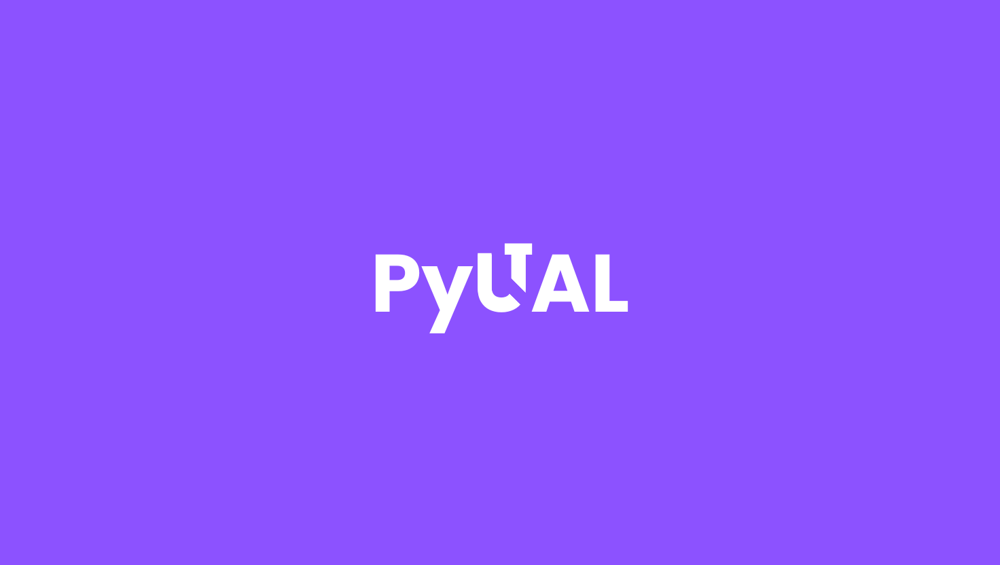

# PyUTAL For Python

[]()

[](https://github.com/thiagostilo2121/utal)
[](https://pypi.org/project/utal/)
[](LICENSE)
[](docs/temp/index.md)

PyUTAL (*Unofficial TikTok Automation Library*) is a Python library designed to develop chatbots or automate TikTok's direct messages (not TikTok Live) using Selenium.

## Installation

To install PyUTAL, it is recommended to first create a virtual environment to isolate project dependencies. Follow these steps:

1. Install `virtualenv` if you don’t have it yet:
   ```sh
   pip install virtualenv
   ```
2. Create a virtual environment:
   ```sh
   python3 -m venv venv
   ```
3. Activate the virtual environment:
   - **Windows:**
     ```sh
     venv\Scripts\activate
     ```
   - **Linux/macOS:**
     ```sh
     source venv/bin/activate
     ```
4. Install `utal` inside the virtual environment:
   ```sh
   pip install utal
   ```

## Quick Start

Here is a guide to setting up a simple project using `utal`.

1. Initialize the `webdriver` with Selenium **without** headless mode the first time to log in manually.
2. Then, use the following code:

```python
import os
from utal.core import PyUTAL
from selenium import webdriver
from selenium.webdriver.chrome.service import Service

def startup_selenium():
    USERDATADIR = os.path.abspath("path/to/user/data/directory")
    DRIVERPATH = "path/to/webdriver"

    options = webdriver.ChromeOptions()
    options.add_experimental_option("detach", True)
    options.add_argument("--headless")  # Run without headless mode the first time
    options.add_argument(rf"user-data-dir={USERDATADIR}")
    
    driver = webdriver.Chrome(service=Service(DRIVERPATH), options=options)
    return driver  # Important to return the driver

def main(driver, app: PyUTAL):
    driver.get("https://tiktok.com/messages")
    
    while True:  # Important to use loops
        message = app.client.listen()  # Retrieves all messages
        if message:
            print(message)

        if message and message == "hello":  
            user_nickname = app.conversation.get_user_nickname()
            app.conversation.send(f"Hi, {user_nickname} 🌟")

if __name__ == "__main__":
    driver = startup_selenium()
    app = PyUTAL(driver)
    main(driver, app)
```

- Console output (if the user sends "hello")

```sh
hello
```

- Bot response (if the nickname is "thiago")
```sh
Hi, thiago 🌟
```

## Important Notes
- **Headless mode must be disabled the first time** to allow manual login and save session data.
- **A loop is required** for the bot to continuously listen for incoming messages.
- **The bot does NOT have a prefix configured and does not filter its own messages** in this example. See the [documentation](docs/temp/index.md) to learn how to implement that.

## Next Steps
These are just recommendations.

- Implement a system of custom prefixes for each user.
- Develop a `command handler` to structure the bot’s commands better.
- Use a database to store bot or user information.
- Take inspiration from Discord bot development structures.
- Experiment and test the different functions of the library.
- See the [Selenium documentation](https://www.selenium.dev/documentation/) to scale the project.

## Disclaimers

By using PyUTAL from the `utal` library, you agree to the following terms. If you do not agree, we recommend you stop using PyUTAL:

- This library was created for educational purposes and must be used at your own risk. The creator and/or contributors are not responsible for any misuse of the tool.
- This is not an official TikTok tool.
- This tool does not connect to TikTok's official APIs; it only performs automation through `scraping`.

## License
This project is licensed under the **MIT License**. See the [LICENSE](LICENSE) file for more details.

